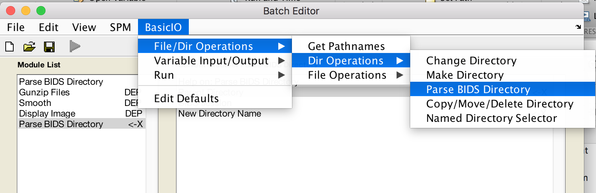
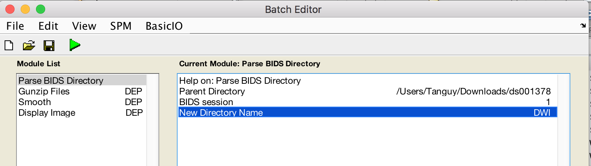
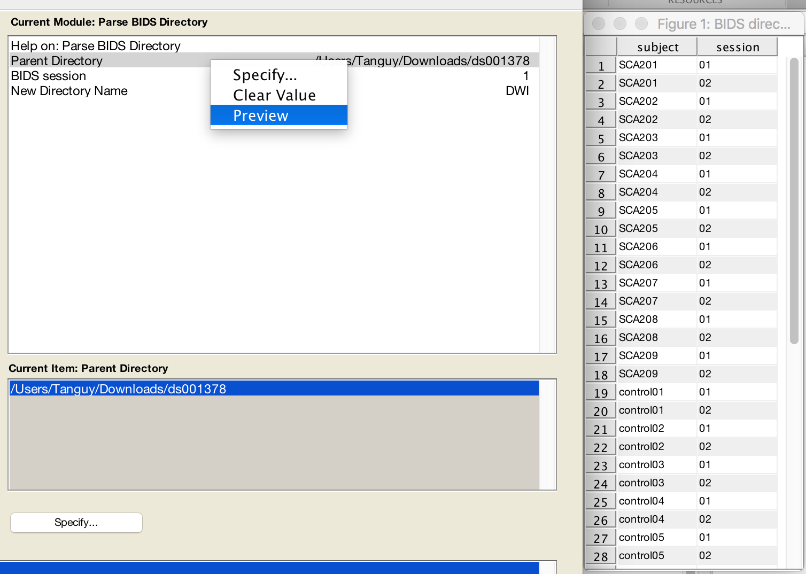
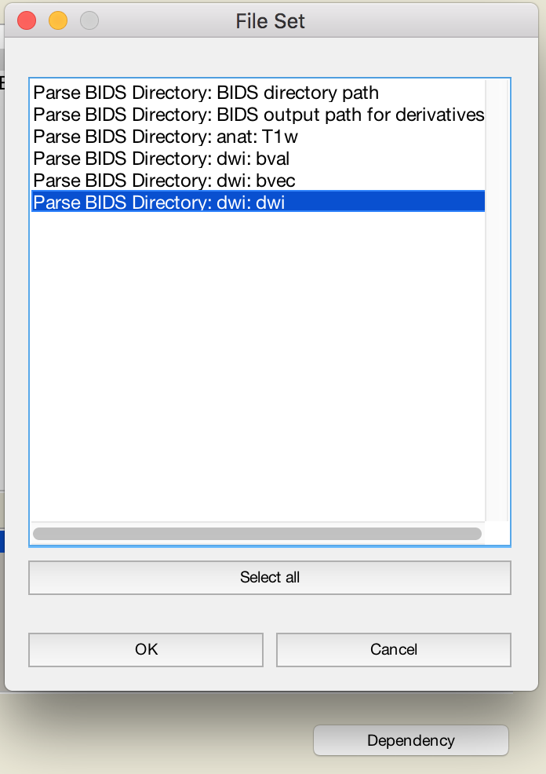
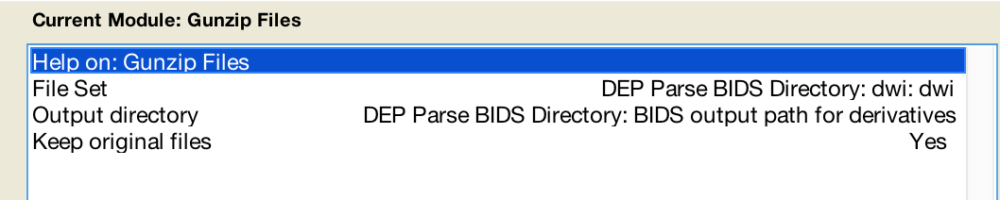
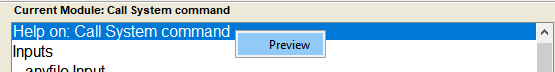
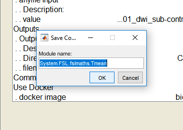
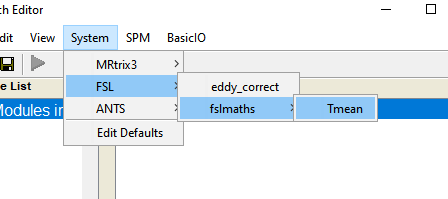

EXTENDED EDITION
Toulouse Neuromaging Center - Inserm - UMR 1214
Tanguy Duval

## Documentation

* [Installation](#install)
* [Features](#features)
	- [BIDS parser module: create a participant BIDS pipeline in just a minute](#bids-parser-module)
	- [Generic System call (run FSL, ANTS, Freesurfer, ... or your own app)](#generic-system-call)
  
## INSTALL

`git clone --recurse-submodules https://github.com/tanguyduval/spm12.git`
````matlab
addpath pathtospm/spm12
addpath(fullfile(spm('Dir'),'matlabbatch'));
addpath(fullfile(spm('Dir'),'config'));
addpath(genpath(fullfile(spm('Dir'),'matlabbatch','cfg_basicio')));
````

## FEATURES
### BIDS parser module
   *create a participant BIDS pipeline in just a minute*
  - download an example BIDS dataset: https://openneuro.org/datasets/ds001378/versions/00003
  - open the matlabbatch using command `cfg_ui`
  - **Add** a new module Parse BIDS
  
  
  - **Fill** module as follows
  
  
  - **Preview** your BIDS dataset
  
  
  - add a new module BasicIO>FileOperation>Gunzip files
  - Use the **dependency** button and select one modality (e.g. dwi) and fill as follows
  
  
  
  
  - Add additional modules or just click **run**. Subject 1 session 1 will be processed.  
  Results will be saved into `bidsfolder/derivatives/matlabbatch/sub-NAME/ses-SESSION/DWI/`
  - **Save** your single participant pipeline using the save icon and loop over your subjects/sessions
  ````matlab
  for isub=1:5
  matlabbatch{1}.cfg_basicio.file_dir.dir_ops.cfg_parsebids.bids_ses = isub;
  spm_jobman('run',matlabbatch)
  end
  ````
  - **Share** your pipeline (copy paste to your Matlab command line):
  ````matlab
  % smooth diffusion data
clear matlabbatch
matlabbatch{1}.cfg_basicio.file_dir.dir_ops.cfg_parsebids.parent = '<UNDEFINED>';
matlabbatch{1}.cfg_basicio.file_dir.dir_ops.cfg_parsebids.bids_ses = 1;
matlabbatch{1}.cfg_basicio.file_dir.dir_ops.cfg_parsebids.name = 'DWI';
matlabbatch{2}.cfg_basicio.file_dir.file_ops.cfg_gunzip_files.files(1) = cfg_dep('Parse BIDS Directory: dwi: dwi', substruct('.','val', '{}',{1}, '.','val', '{}',{1}, '.','val', '{}',{1}, '.','val', '{}',{1}), substruct('.','dwi_dwi'));
matlabbatch{2}.cfg_basicio.file_dir.file_ops.cfg_gunzip_files.outdir(1) = cfg_dep('Parse BIDS Directory: BIDS output path for derivatives', substruct('.','val', '{}',{1}, '.','val', '{}',{1}, '.','val', '{}',{1}, '.','val', '{}',{1}), substruct('.','bidsderivatives'));
matlabbatch{2}.cfg_basicio.file_dir.file_ops.cfg_gunzip_files.keep = true;
matlabbatch{3}.spm.spatial.smooth.data(1) = cfg_dep('Gunzip Files: Gunzipped Files', substruct('.','val', '{}',{2}, '.','val', '{}',{1}, '.','val', '{}',{1}, '.','val', '{}',{1}), substruct('()',{':'}));
matlabbatch{3}.spm.spatial.smooth.fwhm = [8 8 8];
matlabbatch{3}.spm.spatial.smooth.dtype = 0;
matlabbatch{3}.spm.spatial.smooth.im = 0;
matlabbatch{3}.spm.spatial.smooth.prefix = 's';
matlabbatch{4}.spm.util.disp.data(1) = cfg_dep('Smooth: Smoothed Images', substruct('.','val', '{}',{3}, '.','val', '{}',{1}, '.','val', '{}',{1}), substruct('.','files'));

% open gui
cfg_ui(matlabbatch)
  ````
  
### Generic System call
*(run FSL, ANTS, Freesurfer, ... or your own app)*
  - install and run docker (https://www.docker.com/get-started). highly recommanded. On windows you need windows 10. 
  - Download a 4D image https://openneuro.org/crn/datasets/ds001378/snapshots/00003/files/sub-control01:ses-01:dwi:sub-control01_ses-01_dwi.nii.gz
  - open the matlabbatch using command `cfg_ui`
  - **Add** a new module Call System Command
  
  
  - **Fill** the module as follows  
       *Use Docker: docker images with preinstalled neuroimaging softwares can be found on https://hub.docker.com/   
                   `bids/mrtrix3-connectome` includes ANTS MRtrix3 and FSL
                   docker images will be automatically downloaded and inputs/output folders mounted  
                   if you choose "NO", command will be run locally*  
  
   
   - **RUN** the command using the green play button
   - **Save** your preset module
  
  
  
  - **Reload** modules
````matlab
cfg_util('initcfg')
cfg_ui
````

  - **Use** your preset module in an other pipeline
  

  - Your preset is saved under `spm12\matlabbatch\cfg_basicio\System`  
    in `cfg_System_def.m` you have your preset values  
````matlab
system.fsl.fslmaths.tmean.inputs_SetDefaultValOnLoad{1}.anyfilebranch.help = '4D image (NIFTI)';
system.fsl.fslmaths.tmean.inputs_SetDefaultValOnLoad{1}.anyfilebranch.anyfile = '<UNDEFINED>';
system.fsl.fslmaths.tmean.outputs_SetDefaultValOnLoad{1}.outputs.help = 'time-averaged image';
system.fsl.fslmaths.tmean.outputs_SetDefaultValOnLoad{1}.outputs.directory = '<UNDEFINED>';
system.fsl.fslmaths.tmean.outputs_SetDefaultValOnLoad{1}.outputs.string = 'dwi_mean.nii';
system.fsl.fslmaths.tmean.cmd = 'fslmaths i1 -Tmean o1';
system.fsl.fslmaths.tmean.usedocker_SetDefaultValOnLoad.dockerimg = 'bids/mrtrix3_connectome';
  ````
in `cfg_System.m` you have the menu description for the GUI  
````matlab
% ---------------------------------------------------------------------
% fslmaths fslmaths
% ---------------------------------------------------------------------
fslmaths         = cfg_choice;
fslmaths.tag     = 'fslmaths';
fslmaths.name    = 'fslmaths';
fslmaths.values  = {tmean };
% ---------------------------------------------------------------------
% fsl FSL
% ---------------------------------------------------------------------
fsl         = cfg_choice;
fsl.tag     = 'fsl';
fsl.name    = 'FSL';
fsl.values  = {eddy_correct fslmaths };
% ---------------------------------------------------------------------
% system System
% ---------------------------------------------------------------------
cfg         = cfg_choice;
cfg.tag     = 'system';
cfg.name    = 'System';
cfg.values  = {mrtrix3 fsl ants };
````
  

## Use spm12 standalone (no matlab). Not ready yet...
#### CMD:  
help of the first layer (standalone binary):
````
docker run -it -v C:\Users\TONIC\code\spm12:/spm --entrypoint "/spm/spm_standalone_linux/run_spm12.sh" spm12 /opt/mcr/v92 -h
````
help of second layer (bids_app)
````
docker run -it -v C:\Users\TONIC\Documents\code\spm12:/spm12 -v F:\STEMRI_NIFTI_RAW:/bids --entrypoint "/spm12/spm_standalone_linux/run_spm12.sh" spm12 /opt/mcr/v92 script /spm12/spm_BIDS_App.m -h
````
run a config  
````
docker run -it -v C:\Users\TONIC\code\spm12:/spm12 -v F:\STEMRI_NIFTI_RAW:/bids --entrypoint "/spm12/spm_standalone_linux/run_spm12.sh" spm12 /opt/mcr/v92 script /spm12/spm_BIDS_App.m /bids /bids/derivatives participant --config /spm12/apps/MRtrix3/mrtrix_example.m --skip-bids-validator
````

#### GUI:
###### Windows
1. install Xserveur (Xming on windows)
2. 
````
export IP = ???
docker run -it -v C:\Users\TONIC\data\ds001378:bids -v C:\Users\TONIC\code\spm12:/spm12 --entrypoint "/spm12/spm_standalone_linux/run_spm12.sh" -e DISPLAY=$IP:0 spm12 /opt/mcr/v92 eval cfg_ui
````

###### MacOs
1. Install Xquartz
2. Determine your IP `IP=$(ifconfig en0 | grep inet | awk '$1=="inet" {print $2}')`
3. Add your IP to Xquartz `xhost + $IP`
4. 
````
docker run -it -v /Users/TONIC/data/ds001378:bids /Users/TONIC/code/spm12 --entrypoint "/spm12/spm_standalone_linux/run_spm12.sh" -e DISPLAY=$IP:0 spm12 /opt/mcr/v92 eval cfg_ui
````


## Compile spm12 using a docker with matlab compiled in it
````
docker run -it -v C:\Users\code\spm12:/spm12 --entrypoint "/spm_make_standalone.sh" myrepo/matlab
````
with
spm_make_standalone.sh : 
````
#!/bin/sh
# script for spm12 deployement
rm -rf /spm12/spm_standalone_linux
mkdir /spm12/spm_standalone_linux
/usr/local/MATLAB/R2017a/bin/matlab -nodesktop -nosplash -r "addpath('/spm12'); cd('/spm12/config'); spm_make_standalone('/spm12/spm_standalone_linux')"
````

````matlab
%   ___  ____  __  __
%  / __)(  _ \(  \/  )  
%  \__ \ )___/ )    (   Statistical Parametric Mapping
%  (___/(__)  (_/\/\_)  SPM -  http://www.fil.ion.ucl.ac.uk/spm/
% 
%                               R E A D M E
% 
%__________________________________________________________________________
% 
% This README gives a brief introduction to the SPM software.
% Full details can be found on the SPM website:
% 
%                      http://www.fil.ion.ucl.ac.uk/spm/
% 
% See also Contents.m, AUTHORS.txt and LICENCE.txt.
%  
%__________________________________________________________________________
%                                                                       SPM
% 
%     Statistical Parametric Mapping refers to the construction and
%     assessment of spatially extended statistical process used to
%     test hypotheses about functional imaging data. These ideas have
%     been instantiated in software that is called SPM.
%     The SPM software package has been designed for the analysis of 
%     brain imaging data sequences. The sequences can be a series of 
%     images from different cohorts, or time-series from the same 
%     subject. The current release is designed for the analysis of
%     fMRI, PET, SPECT, EEG and MEG.
% 
%                               ----------------
% 
% Please refer to this version as "SPM12" in papers and communications.
% 
%                               ----------------
% 
% SPM was written to organise and interpret our data (at the Wellcome
% Trust Centre for Neuroimaging). The distributed version is the same as
% that we use ourselves.
% 
% SPM is made freely available to the [neuro]imaging community, to
% promote collaboration and a common analysis scheme across laboratories.
% 
%__________________________________________________________________________
%                                                                  Software
% 
% The SPM software is a suite of MATLAB functions, scripts and data files,
% with some externally compiled C routines, implementing Statistical
% Parametric Mapping.  MATLAB, a commercial engineering mathematics
% package, is required to use SPM.  MATLAB is produced by MathWorks,
% Natick, MA, USA. http://www.mathworks.com/
% SPM requires only core MATLAB to run (no special toolboxes are required).
%  
% SPM12 is written for MATLAB version 7.4 (R2007a) onwards under Windows,
% Linux and Mac (SPM12 will not work with versions of MATLAB prior to 7.4).
% Binaries of the external C-MEX routines are provided for Windows, Linux 
% and Mac. The source code is supplied and can be compiled with a C
% compiler (Makefile provided).
% See http://www.fil.ion.ucl.ac.uk/spm/software/spm12/ for details.
% 
% Later versions of MATLAB (released after SPM12), will probably need
% additional patches in order to run.  Once developed, these will be made
% available from:
%        http://www.fil.ion.ucl.ac.uk/spm/download/spm12_updates/
% 
% Although SPM12 will read image files from previous versions of SPM, there
% are differences in the algorithms, templates and models used.  Therefore,
% we recommend you use a single SPM version for any given project.
% 
% The SPM12 Release Notes can be found online: 
%              http://www.fil.ion.ucl.ac.uk/spm/software/spm12/
% 
%__________________________________________________________________________
%                                                               File format
% 
% SPM12 uses the NIFTI-1 data format as standard.  Take a look at
%                         http://nifti.nimh.nih.gov/
% for more information on the NIFTI-1 file format.
% 
% The old SPM2 version of Analyze format can be read straight into SPM12,
% but results will be written out as NIFTI-1.  If you still use this
% format, then it is important that you ensure that spm_flip_analyze_images
% has been set appropriately for your data.
% 
% The MINC and ECAT7 formats can not be read straight into SPM12, although
% conversion utilities have been provided.  Similarly, a number of DICOM
% flavours can also be converted to NIFTI-1 using tools in SPM12.
% 
%__________________________________________________________________________
%                                                                 Resources
% 
% The SPM website is the central repository for SPM resources:
%                  http://www.fil.ion.ucl.ac.uk/spm/
% Introductory material, installation details, documentation, course
% details and patches are published on the site.
% 
% There is an SPM eMail discussion list, hosted at <spm@jiscmail.ac.uk>.
% The list is monitored by the authors, and discusses theoretical,
% methodological and practical issues of Statistical Parametric Mapping
% and SPM. The SPM website has further details:
%                  http://www.fil.ion.ucl.ac.uk/spm/support/
% 
% Please report bugs to the authors at <fil.spm@ucl.ac.uk>.
% Peculiarities may actually be features, and should be raised on the SPM
% eMail discussion list, <spm@jiscmail.ac.uk>.
% 
%__________________________________________________________________________
%                                                                   Authors
% 
% SPM is developed under the auspices of Functional Imaging Laboratory
% (FIL), The Wellcome Trust Centre for NeuroImaging, in the Institute of
% Neurology at University College London (UCL), UK.
% 
% SPM94 was written primarily by Karl Friston in the first half of
% 1994, with assistance from John Ashburner (MRC-CU), Jon Heather
% (WDoIN), and Andrew Holmes (Department of Statistics, University of
% Glasgow). Subsequent development, under the direction of Prof. Karl
% Friston at the Wellcome Department of Imaging Neuroscience, has
% benefited from substantial input (technical and theoretical) from:
% John Ashburner (WDoIN), Andrew Holmes (WDoIN & Robertson Centre for
% Biostatistics, University of Glasgow, Scotland), Jean-Baptiste Poline
% (WDoIN & CEA/DRM/SHFJ, Orsay, France), Christian Buechel (WDoIN),
% Matthew Brett (MRC-CBU, Cambridge, England), Chloe Hutton (WDoIN) and
% Keith Worsley (Department of Statistics, McGill University, Montreal,
% Canada).
% 
% See AUTHORS.txt for a complete list of SPM co-authors.
% 
% We would like to thank everyone who has provided feedback on SPM.
% 
%__________________________________________________________________________
%                                         Disclaimer, copyright & licencing
% 
% SPM (being the collection of files given in the manifest in the
% Contents.m file) is free but copyright software, distributed under the
% terms of the GNU General Public Licence as published by the Free 
% Software Foundation (either version 2, as given in file LICENCE.txt,
% or at your option, any later version). Further details on "copyleft" can
% be found at http://www.gnu.org/copyleft/. In particular, SPM is supplied
% as is.  No formal support or maintenance is provided or implied.
% 
%__________________________________________________________________________
% % Copyright (C) 1991,1994-2017 Wellcome Trust Centre for Neuroimaging
% 
% $Id: README.txt 6980 2017-01-04 10:10:29Z guillaume $
````
