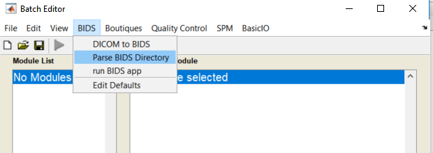
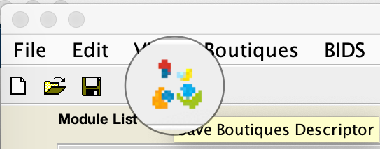
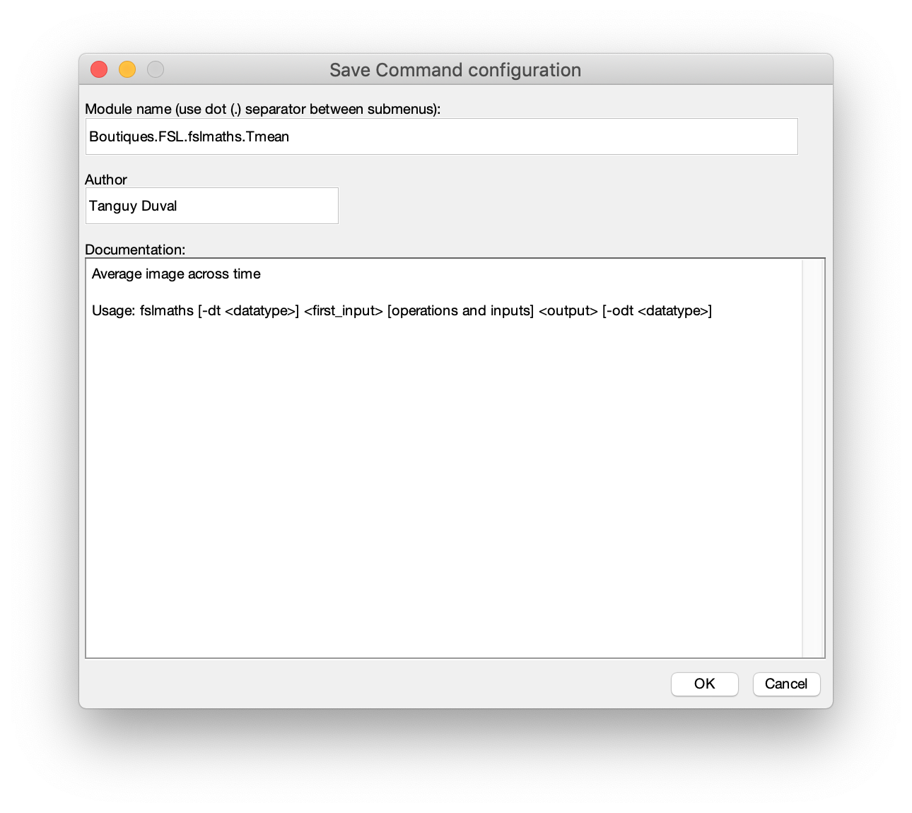
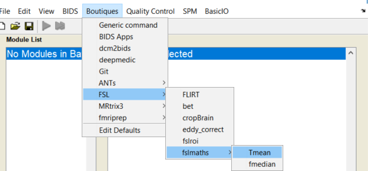

EXTENDED EDITION
Toulouse Neuromaging Center - Inserm - UMR 1214
Tanguy Duval

## Documentation

* [Installation](#install)
* [Features](#features)
	- [BIDS parser module: create a participant BIDS pipeline in just a minute](#bids-parser-module)
	- [Boutiques (run FSL, ANTS, Freesurfer, ... or any command)](#boutiques)
  
## INSTALL
  1. Install spm12 if you don't have it: https://www.fil.ion.ucl.ac.uk/spm/software/spm12/
  2. [R2014b or later] Copy-Paste in your Matlab command line:
````matlab
% CHANGE DIRECTORY to default Matlab path
cd(userpath)
% DOWNLOAD spm-apps
websave('spm12-apps.zip','https://github.com/tanguyduval/spm12-apps/archive/master.zip')
unzip spm12-apps.zip
% ADD to Matlab path
addpath(fullfile('spm12-apps-master','BIDS'))
addpath(fullfile('spm12-apps-master','Boutiques'))
addpath(fullfile('spm12-apps-master','QualityControl'))
savepath
% RUN spm Batch Editor
cfg_util('initcfg')
cfg_ui
````

[R2014a or older] In spm Batch Editor: 
`File-->Add Application-->select cfg_mlbatch_appcfg.m` in each folder

## FEATURES
### BIDS parser module
   *create a participant BIDS pipeline in just a minute*
  - download an example BIDS dataset: https://openneuro.org/datasets/ds001378/versions/00003
  - open the matlabbatch using command `cfg_ui`
  - **Add** a new module Parse BIDS
  
  
  - **Fill** module as follows
  
  
  - **Preview** your BIDS dataset
  
  
  - add a new module BasicIO>FileOperation>Gunzip files
  - Use the **dependency** button and select one modality (e.g. dwi) and fill as follows
  
  
  
  
  - Add additional modules or just click the **run** icon. Subject 1 session 1 will be processed.  
  Results will be saved into `bidsfolder/derivatives/matlabbatch/sub-NAME/ses-SESSION/DWI/`
  - Click on the **run for all subjects** icon (double play icon) to loop across all subjects/sessions
  - **Save** your single participant pipeline using the save icon into a m-file
  - **Share** your pipeline. For instance, you can simply copy paste this saved pipeline to your Matlab command line:
  ````matlab
  % smooth diffusion data
clear matlabbatch

matlabbatch{1}.cfg_BIDS.cfg_parsebids.parent = '<UNDEFINED>';
matlabbatch{1}.cfg_BIDS.cfg_parsebids.bids_ses_type.bids_sesnum = 1;
matlabbatch{1}.cfg_BIDS.cfg_parsebids.derivativesname = 'DWI';
matlabbatch{1}.cfg_BIDS.cfg_parsebids.bids_ref_type.noref = true;
matlabbatch{2}.cfg_basicio.file_dir.file_ops.cfg_gunzip_files.files(1) = cfg_dep('Parse BIDS Directory: dwi: dwi', substruct('.','val', '{}',{1}, '.','val', '{}',{1}), substruct('.','dwi_dwi'));
matlabbatch{2}.cfg_basicio.file_dir.file_ops.cfg_gunzip_files.outdir = {''};
matlabbatch{2}.cfg_basicio.file_dir.file_ops.cfg_gunzip_files.keep = true;
matlabbatch{3}.spm.spatial.smooth.data(1) = cfg_dep('Parse BIDS Directory: dwi: dwi', substruct('.','val', '{}',{1}, '.','val', '{}',{1}), substruct('.','dwi_dwi'));
matlabbatch{3}.spm.spatial.smooth.fwhm = [8 8 8];
matlabbatch{3}.spm.spatial.smooth.dtype = 0;
matlabbatch{3}.spm.spatial.smooth.im = 0;
matlabbatch{3}.spm.spatial.smooth.prefix = 's';
matlabbatch{4}.QC.imtool3D.nifti(1) = cfg_dep('Gunzip Files: Gunzipped Files', substruct('.','val', '{}',{2}, '.','val', '{}',{1}, '.','val', '{}',{1}, '.','val', '{}',{1}), substruct('()',{':'}));
matlabbatch{4}.QC.imtool3D.nifti(2) = cfg_dep('Smooth: Smoothed Images', substruct('.','val', '{}',{3}, '.','val', '{}',{1}, '.','val', '{}',{1}), substruct('.','files'));
matlabbatch{4}.QC.imtool3D.mask = {''};

% open Batch editor if not opened
cfg_ui
% load pipeline
cfg_util('initjob',matlabbatch)
cfg_ui
  ````
  
### Boutiques
*(run FSL, ANTS, Freesurfer, ... or your own app)*
  - install and run docker (https://www.docker.com/get-started). highly recommanded. On windows you need windows 10. 
  - Download a 4D image https://openneuro.org/crn/datasets/ds001378/snapshots/00003/files/sub-control01:ses-01:dwi:sub-control01_ses-01_dwi.nii.gz
  - open the matlabbatch using command `cfg_ui`
  - **Add** a new module Call System Command
  
  
  - **Fill** the module as follows  
       *Use Docker: docker images with preinstalled neuroimaging softwares can be found on https://hub.docker.com/   
                   `bids/mrtrix3-connectome` includes ANTS MRtrix3 and FSL
                   docker images will be automatically downloaded and inputs/output folders mounted  
                   if you choose "NO", command will be run locally*  
  
   
   - **RUN** the command using the green play button
   - **Save** your preset module as a Boutiques descriptor https://boutiques.github.io
  
  
  
  - **Reload** modules
````matlab
cfg_util('initcfg')
cfg_ui
````

  - **Use** your preset module in an other pipeline
  

  - Your preset is saved under `spm-apps\Boutiques\Boutiques`  
